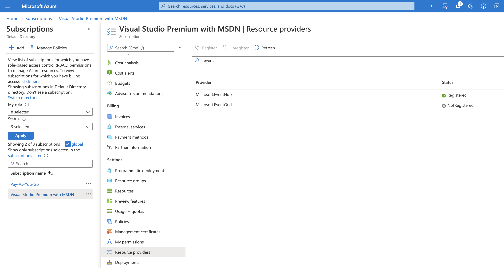
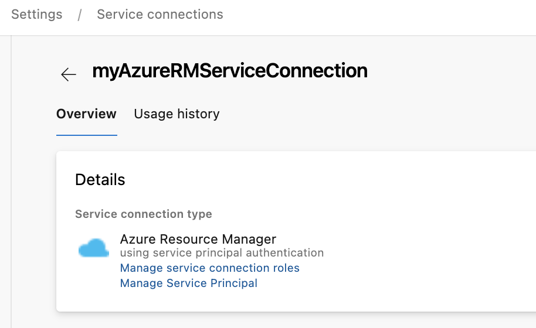
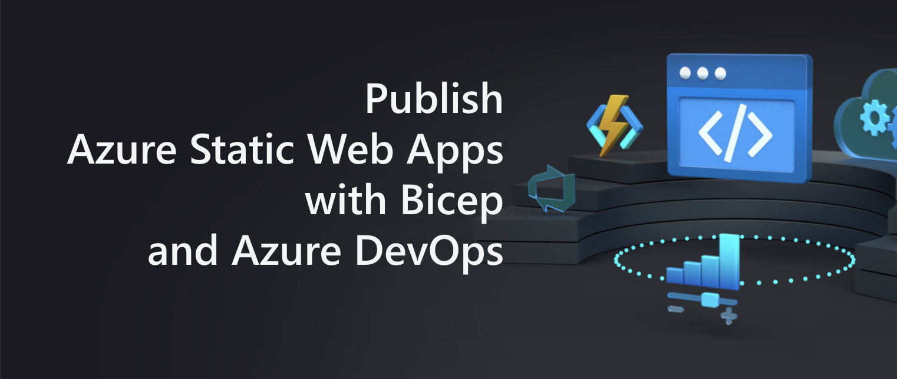
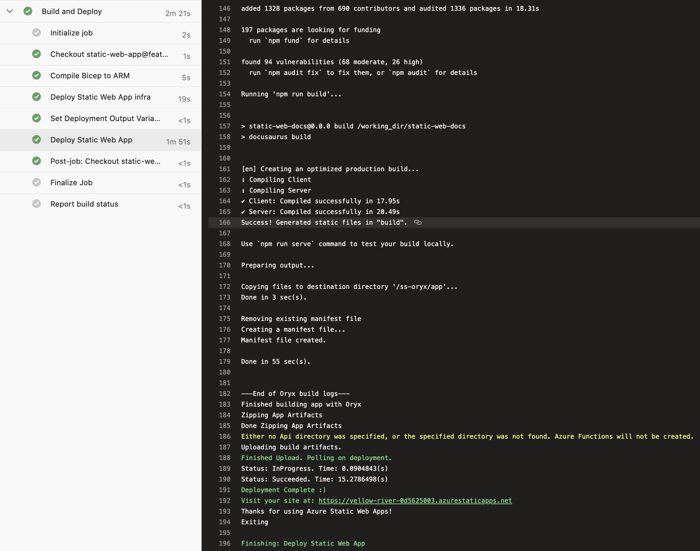
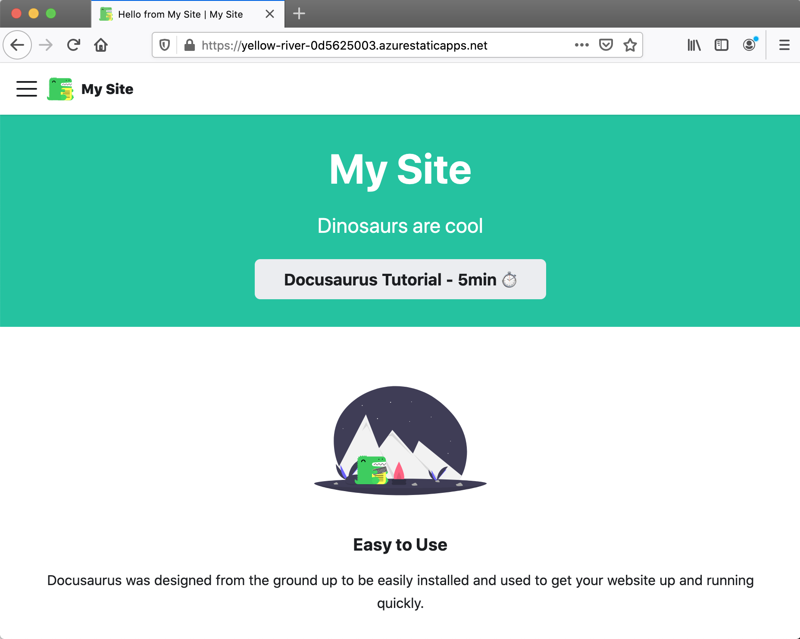

We want to test our newly deployed Azure resources in the context of an Azure Pipeline.  We'll permission our Azure Pipeline to access these resources using role assignments. Finally we'll write a dotnet test that runs in the context of the pipeline and makes use of those role assignments.

We're following this approach as an alternative to exporting connection strings, as these can be viewed in the Azure Portal; which may be an security issue if you have many people who are able to access the portal and view outputs.


There's a number of things we need to have set up before we can actually get deploying:

- Add Event Hubs to your subscription
- Permission your service connection / service principal

## Add Event Hubs to your subscription

First of all, we may need to add Event Hubs to our Azure subscription.

Without this in place, we may encounter errors of the type:

> ##[error]MissingSubscriptionRegistration: The subscription is not registered to use namespace 'Microsoft.EventHub'. See https://aka.ms/rps-not-found for how to register subscriptions.

We do this by going to "Resource Providers" in the [Azure Portal](https://portal.azure.com) and registering the resources you need. Lots are registered by default, but not all.



## Permission our service connection / service principal

In order that we can run pipelines related to Azure, we mostly need to have an Azure Resource Manager service connection set up in Azure DevOps.  Once that exists, we also need to give it a role assignment to allow it to create role assignments of its own when pipelines are running.

Without this in place, we may encounter errors of the type:

> ##[error]The template deployment failed with error: 'Authorization failed for template resource '{GUID-THE-FIRST}' of type 'Microsoft.Authorization/roleAssignments'. The client '{GUID-THE-SECOND}' with object id '{GUID-THE-SECOND}' does not have permission to perform action 'Microsoft.Authorization/roleAssignments/write' at scope '/subscriptions/***/resourceGroups/johnnyreilly/providers/Microsoft.EventHub/namespaces/evhns-demo/providers/Microsoft.Authorization/roleAssignments/{GUID-THE-FIRST}'.'.

Essentially, we want to be able to run pipelines that say "hey Azure, we want to give permissions to our service connection".  We are doing this *with* the self same service connection, so (chicken and egg) we first need to give it permission to give those commands in future.  This is a little confusing; but let's role with it. (Pun most definitely intended. 😉)

To grant that permission / add that role assignment, we go to the service connection in Azure Devops:



We can see there's two links here; first we'll click on "Manage Service Principal", which will take us to the service principal in the Azure Portal:


Take note of the display name of the service principal; we'll need that as we click on the "Manage service connection roles" link, which will take us to the resource groups IAM page in the Azure Portal:


Here we can click on "Add role assignment", select "Owner":


Then when selecting members we should be able to look up the service principal to assign it:


We now have a service connection which we should be able to use for granting permissions / role assignments, which is what we need.

## Event Hub and Role Assignment with Bicep

Next we want a Bicep file that will, when run, provision an Event Hub and a role assignment which will allow our Azure Pipeline (via its service connection) to interact with it.

```bicep
@description('Name of the eventhub namespace')
param eventHubNamespaceName string

@description('Name of the eventhub name')
param eventHubName string

@description('The service principal')
param principalId string

// Create an event hub namespace
resource eventHubNamespace 'Microsoft.EventHub/namespaces@2021-01-01-preview' = {
  name: eventHubNamespaceName
  location: resourceGroup().location
  sku: {
    name: 'Standard'
    tier: 'Standard'
    capacity: 1
  }
  properties: {
    zoneRedundant: true
  }
}

// Create an event hub inside the namespace
resource eventHubNamespaceName_eventHubName 'Microsoft.EventHub/namespaces/eventhubs@2021-01-01-preview' = {
  parent: eventHubNamespace
  name: eventHubName
  properties: {
    messageRetentionInDays: 7
    partitionCount: 1
  }
}

// Grant Listen and Send on our event hub
resource eventHubNamespaceName_eventHubName_ListenSend 'Microsoft.EventHub/namespaces/eventhubs/authorizationRules@2021-01-01-preview' = {
  parent: eventHubNamespaceName_eventHubName
  name: 'ListenSend'
  properties: {
    rights: [
      'Listen'
      'Send'
    ]
  }
  dependsOn: [
    eventHubNamespace
  ]
}

// give Azure Pipelines Service Principal permissions against the namespace 

var roleDefinitionAzureEventHubsDataOwner = subscriptionResourceId('Microsoft.Authorization/roleDefinitions', 'f526a384-b230-433a-b45c-95f59c4a2dec')

resource integrationTestEventHubReceiverNamespaceRoleAssignment 'Microsoft.Authorization/roleAssignments@2018-01-01-preview' = {
  name: guid(principalId, eventHubNamespace.id, roleDefinitionAzureEventHubsDataOwner)
  scope: eventHubNamespace
  properties: {
    roleDefinitionId: roleDefinitionAzureEventHubsDataOwner
    principalId: principalId
  }
}
```

## Azure Pipeline

We'll begin by creating a Repo in Azure DevOps which we're going to work in. Then we're going to add an `azure-pipelines.yml` file which Azure DevOps can use to power a pipeline:  

```yml
trigger:
  - main
  
pool:
  vmImage: ubuntu-latest

steps:
- bash: az bicep build --file infra/static-web-app/main.bicep
  displayName: "Compile Bicep to ARM"

- task: AzureResourceManagerTemplateDeployment@3
  name: DeployStaticWebAppInfra
  displayName: Deploy Static Web App infra
  inputs:
    deploymentScope: Resource Group
    azureResourceManagerConnection: $(serviceConnection)
    subscriptionId: $(subscriptionId)
    action: Create Or Update Resource Group
    resourceGroupName: $(azureResourceGroup)
    location: $(location)
    templateLocation: Linked artifact
    csmFile: 'infra/static-web-app/main.json' # created by bash script
    overrideParameters: >-
      -repositoryUrl $(repo)
      -repositoryBranch $(Build.SourceBranchName)
      -appName $(staticWebAppName)
    deploymentMode: Incremental
    deploymentOutputs: deploymentOutputs

- task: PowerShell@2
  name: 'SetDeploymentOutputVariables'
  displayName: "Set Deployment Output Variables"
  inputs:
    targetType: inline
    script: |
      $armOutputObj = '$(deploymentOutputs)' | ConvertFrom-Json
      $armOutputObj.PSObject.Properties | ForEach-Object {
        $keyname = $_.Name
        $value = $_.Value.value

        # Creates a standard pipeline variable
        Write-Output "##vso[task.setvariable variable=$keyName;]$value"

        # Creates an output variable
        Write-Output "##vso[task.setvariable variable=$keyName;issecret=true;isOutput=true]$value"

        # Display keys in pipeline
        Write-Output "output variable: $keyName"
      }
    pwsh: true

- task: AzureStaticWebApp@0
  name: DeployStaticWebApp
  displayName: Deploy Static Web App
  inputs:
    app_location: 'static-web-app'
    # api_location: 'api'
    output_location: 'build'
    azure_static_web_apps_api_token: $(deployment_token) # captured from deploymentOutputs
```

When the pipeline is run, it does the following:

1. Compiles our Bicep into an ARM template
2. Deploys the compiled ARM template to Azure
3. Captures the deployment outputs (essentially the `deployment_token`) and converts them into variables to use in the pipeline
4. Deploys our Static Web App using the `deployment_token`

The pipeline depends upon a number of variables:
- `azureResourceGroup` - the name of your resource group in Azure where the app will be deployed
- `location` - where your app is deployed, eg `northeurope`
- `repo` - the URL of your repository in Azure DevOps, eg https://dev.azure.com/johnnyreilly/_git/azure-static-web-apps
- `serviceConnection` - the name of your AzureRM service connection in Azure DevOps
- `staticWebAppName` - the name of your static web app, eg `azure-static-web-apps-johnnyreilly`
- `subscriptionId` - your Azure subscription id from the [Azure Portal](https://portal.azure.com)


This post demonstrates how to deploy [Azure Static Web Apps](https://docs.microsoft.com/en-us/azure/static-web-apps/overview) using Bicep and Azure DevOps. It includes a few workarounds for the ["Provider is invalid.  Cannot change the Provider. Please detach your static site first if you wish to use to another deployment provider." issue](https://github.com/Azure/static-web-apps/issues/516).



## Bicep template

The first thing we're going to do is create a folder where our Bicep file for deploying our Azure Static Web App will live:

```bash
mkdir infra/static-web-app -p
```

Then we'll create a `main.bicep` file:

```bicep
param repositoryUrl string
param repositoryBranch string

param location string = 'westeurope'
param skuName string = 'Free'
param skuTier string = 'Free'

param appName string

resource staticWebApp 'Microsoft.Web/staticSites@2020-12-01' = {
  name: appName
  location: location
  sku: {
    name: skuName
    tier: skuTier
  }
  properties: {
    // The provider, repositoryUrl and branch fields are required for successive deployments to succeed
    // for more details see: https://github.com/Azure/static-web-apps/issues/516
    provider: 'DevOps'
    repositoryUrl: repositoryUrl
    branch: repositoryBranch
    buildProperties: {
      skipGithubActionWorkflowGeneration: true
    }
  }
}

output deployment_token string = listSecrets(staticWebApp.id, staticWebApp.apiVersion).properties.apiKey 
```

There's some things to draw attention to in the code above:

1. The `provider`, `repositoryUrl` and `branch` fields are required for successive deployments to succeed. In our case we're deploying via Azure DevOps and so our provider is `'DevOps'`. For more details, [look at this issue](https://github.com/Azure/static-web-apps/issues/516). 
2. We're creating a `deployment_token` which we'll need in order that we can deploy into the Azure Static Web App resource.

## Static Web App

In order that we can test out Azure Static Web Apps, what we need is a static web app.  You could use pretty much anything here; we're going to use Docusaurus.  We'll execute this single command: 

```bash
npx @docusaurus/init@latest init static-web-app classic
```

Which will scaffold a Docusaurus site in a folder named `static-web-app`. We don't need to change it any further; let's just see if we can deploy it.

## Azure Pipeline

We're going to add an `azure-pipelines.yml` file which Azure DevOps can use to power a pipeline:  

```yml
trigger:
  - main
  
pool:
  vmImage: ubuntu-latest

steps:
- checkout: self
  submodules: true
    
- bash: az bicep build --file infra/static-web-app/main.bicep
  displayName: "Compile Bicep to ARM"

- task: AzureResourceManagerTemplateDeployment@3
  name: DeployStaticWebAppInfra
  displayName: Deploy Static Web App infra
  inputs:
    deploymentScope: Resource Group
    azureResourceManagerConnection: $(serviceConnection)
    subscriptionId: $(subscriptionId)
    action: Create Or Update Resource Group
    resourceGroupName: $(azureResourceGroup)
    location: $(location)
    templateLocation: Linked artifact
    csmFile: 'infra/static-web-app/main.json' # created by bash script
    overrideParameters: >-
      -repositoryUrl $(repo)
      -repositoryBranch $(Build.SourceBranchName)
      -appName $(staticWebAppName)
    deploymentMode: Incremental
    deploymentOutputs: deploymentOutputs

- task: PowerShell@2
  name: 'SetDeploymentOutputVariables'
  displayName: "Set Deployment Output Variables"
  inputs:
    targetType: inline
    script: |
      $armOutputObj = '$(deploymentOutputs)' | ConvertFrom-Json
      $armOutputObj.PSObject.Properties | ForEach-Object {
        $keyname = $_.Name
        $value = $_.Value.value

        # Creates a standard pipeline variable
        Write-Output "##vso[task.setvariable variable=$keyName;]$value"

        # Creates an output variable
        Write-Output "##vso[task.setvariable variable=$keyName;issecret=true;isOutput=true]$value"

        # Display keys in pipeline
        Write-Output "output variable: $keyName"
      }
    pwsh: true

- task: AzureStaticWebApp@0
  name: DeployStaticWebApp
  displayName: Deploy Static Web App
  inputs:
    app_location: 'static-web-app'
    # api_location: 'api'
    output_location: 'build'
    azure_static_web_apps_api_token: $(deployment_token) # captured from deploymentOutputs
```

When the pipeline is run, it does the following:

1. Compiles our Bicep into an ARM template
2. Deploys the compiled ARM template to Azure
3. Captures the deployment outputs (essentially the `deployment_token`) and converts them into variables to use in the pipeline
4. Deploys our Static Web App using the `deployment_token`

The pipeline depends upon a number of variables:
- `azureResourceGroup` - the name of your resource group in Azure where the app will be deployed
- `location` - where your app is deployed, eg `northeurope`
- `repo` - the URL of your repository in Azure DevOps, eg https://dev.azure.com/johnnyreilly/_git/azure-static-web-apps
- `serviceConnection` - the name of your AzureRM service connection in Azure DevOps
- `staticWebAppName` - the name of your static web app, eg `azure-static-web-apps-johnnyreilly`
- `subscriptionId` - your Azure subscription id from the [Azure Portal](https://portal.azure.com)

A successful pipeline looks something like this:



What you might notice is that the `AzureStaticWebApp` is itself installing and building our application. This is handled by [Microsoft Oryx](https://github.com/Microsoft/Oryx). The upshot of this is that we don't need to manually run `npm install` and `npm build` ourselves; the `AzureStaticWebApp` task will take care of it for us.

Finally, let's see if we've deployed something successfully...



We have! It's worth noting that you'll likely want to give your Azure Static Web App a lovelier URL, and perhaps even put it behind Azure Front Door as well.

## `Provider is invalid` workaround 2

[Shane Neff](https://www.linkedin.com/in/shaneneff/) was attempting to follow the instructions in this post and encountered issues.  He shared his struggles with me as he encountered the ["Provider is invalid.  Cannot change the Provider. Please detach your static site first if you wish to use to another deployment provider." issue](https://github.com/Azure/static-web-apps/issues/516).

He was good enough to share his solution as well, which is inserting this task at the start of the pipeline (before the `az bicep build` step):

```yml
- task: AzureCLI@2
  inputs:
    azureSubscription: '<name of your service connection>'
    scriptType: 'bash'
    scriptLocation: 'inlineScript'
    inlineScript: 'az staticwebapp disconnect -n <name of your app>'
```

I haven't had the problems that Shane has had myself, but I wanted to share his fix for the people out there who almost certainly are bumping on this.
